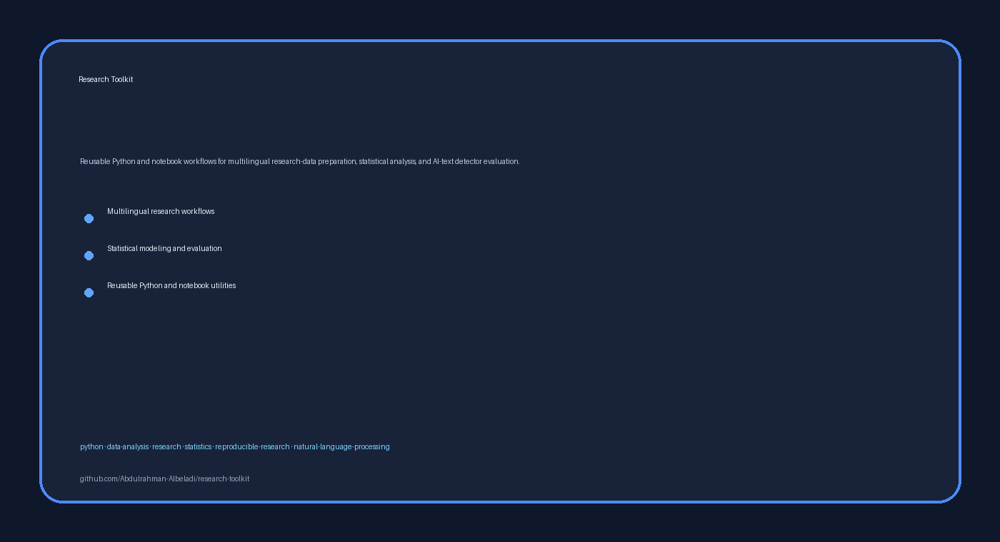

# Research Toolkit

<p align="center">
  
</p>

Reusable Python workflows for repository code extraction and AI-text/code detector evaluation. Network calls are disabled by default; an optional extra enables a third‑party API client when needed.

What this demonstrates for employers
- Production‑minded Python under a src/ package layout
- Robust repository mining with scoring heuristics and careful filtering
- A configurable detection pipeline with retries, budgeting estimates, and safe defaults

What’s inside
- Code detection pipeline: src/research_toolkit/code_detection_pipeline.py
  - Parses free‑form text submissions into internal code files, splits by word budget, and aggregates per‑chunk predictions
  - Offline by default via a deterministic SyntheticDetectorClient; optional PangramDetectorClient uses requests when enabled
- Repository code extraction: src/research_toolkit/repo_code_extraction.py
  - Shallow‑clones repositories, filters high‑signal code by extension/size/heuristics, and produces summaries

Installation
- Requires Python 3.10+
- Base install (no network dependencies):
  - pip install .
- Optional network detector client (adds requests):
  - pip install ".[detector]"

Quickstart (offline by default)
This repo includes empty scaffolding you can use immediately:
- examples/code_submissions
- examples/output

1) Add one or more .txt files under examples/code_submissions. Each file may be a single snippet or contain multiple sections delimited by lines that look like relative file paths (e.g., src/app/main.py). Optional separators like ########## are allowed.

2) Run a short Python snippet that uses the offline synthetic detector:

```python
from pathlib import Path
from research_toolkit.code_detection_pipeline import (
    PipelineConfig,
    SyntheticDetectorClient,
    discover_submissions,
    split_code_by_line_word_limit,
    aggregate_chunk_results,
    word_count,
)

config = PipelineConfig(
    input_root=Path("examples/code_submissions"),
    output_root=Path("examples/output"),
    run_detection=False,
)
client = SyntheticDetectorClient()

for sub in discover_submissions(config.input_root):
    chunk_results = []
    chunk_counts = []
    for item in sub.internal_files:
        for chunk in split_code_by_line_word_limit(item.content, config.max_words_per_chunk):
            chunk_results.append(client.detect(chunk))
            chunk_counts.append(word_count(chunk))
    summary = aggregate_chunk_results(chunk_results, chunk_counts)
    print(f"{sub.relative_path}: {summary['dominant_class']} (AI={summary['fraction_ai']:.2f})")
```

Optional: enable remote detection via a third‑party API
- Install the optional extra: pip install ".[detector]"
- Set credentials via environment (example variable names shown; see Env Vars below):
  - export PANGRAM_API_KEY="...your key..."
- Then use the network client:

```python
from pathlib import Path
from research_toolkit.code_detection_pipeline import PipelineConfig, PangramDetectorClient

config = PipelineConfig(
    input_root=Path("examples/code_submissions"),
    output_root=Path("examples/output"),
    run_detection=True,
)
client = PangramDetectorClient(config)  # requires requests and a valid API key
result = client.detect("def add(a, b): return a + b\n")
print(result.get("prediction"), result.get("fraction_ai"))
```

Important: Do not send sensitive, proprietary, or personal data to any third‑party service. The offline SyntheticDetectorClient is provided for safe demos.

Repository code extraction (overview)
- See src/research_toolkit/repo_code_extraction.py for a utility that:
  - Parses URL lists, shallow‑clones repositories, and walks files safely
  - Filters by extension/size and applies scoring heuristics (syntax cues, path patterns, minified/generated detection)
  - Produces summaries and selected file lists under a configurable output root
- The module exposes dataclasses like ExtractionConfig and helpers such as keep_file(...) and candidate_score(...). Review the docstrings to adapt it to your workflow.

Environment variables (code_detection_pipeline)
The PipelineConfig.from_env() helper recognizes the following variables. If unset, reasonable defaults are used.
- CODE_DETECTION_INPUT_ROOT: path to input folder (default: synthetic_examples/code_submissions)
- CODE_DETECTION_OUTPUT_ROOT: path to output folder (default: synthetic_examples/output)
- CODE_DETECTION_RUN_DETECTION: set to 1/true/yes/on to enable network detection (default: false)
- PANGRAM_API_URL: override the remote endpoint URL
- PANGRAM_API_KEY_ENV_VAR: env var name that holds the API key (default: PANGRAM_API_KEY)
- CODE_DETECTION_MAX_WORDS_PER_CHUNK: integer max words per chunk (default: 2500)
- CODE_DETECTION_TIMEOUT_SECONDS, CODE_DETECTION_MAX_RETRIES, CODE_DETECTION_SECONDS_BETWEEN_REQUESTS
- CODE_DETECTION_CREDIT_BUFFER_MULTIPLIER: multiplier used in simple credit budgeting logic

Privacy and safety
- Offline by default; no data leaves your machine unless you explicitly enable a network detector and provide an API key.
- If you enable run_detection: you consent to send provided text to a third‑party service. Review their terms before use.
- requests is only required for the network client (installed via the [detector] extra).

Arabic summary (ملخص بالعربية)
هذه الحزمة البرمجية تُظهر هندسة بايثون عملية لخطوط عمل البحث: أداة لاستخراج الشيفرة من المستودعات مع قواعد تقييم ذكية، وخط أنابيب لاختبار كواشف النص/الشيفرة بالذكاء الاصطناعي مع إعدادات آمنة بشكل افتراضي. يمكن تشغيله محليًا دون اتصال، مع خيار التكامل مع واجهة برمجية خارجية عند الحاجة.

Portfolio scope
Only public, employer‑relevant implementation material is included. Private research notebooks, internal workflows, cleaned data, and internal documentation are intentionally excluded.

License and attribution
See LICENSE. Third‑party, collaborator‑authored, and course‑provided materials retain their original rights and terms.
